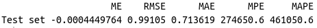

# Rede Neural em R

Este é um algoritmo de redes neurais desenvolvido em R, com o RStudio para previsão da taxa SELIC entre os anos de 2017 e 2020.

A documentação do algoritmo neuralnet encontra-se disponível em:
https://www.rdocumentation.org/packages/neuralnet/versions/1.44.2/topics/neuralnet

O banco de dados CSV também encontra-se disponível no mesmo repositório do GitHub do algoritmo.

## Pacotes necessários

* neuralnet
* quantmod
* grt
* zoo
* forecast

## Gráfico da rede neural

	

## Gráfico da SELIC no período

	

## Gráfico da previsão da SELIC

	

## Acurácia

	

